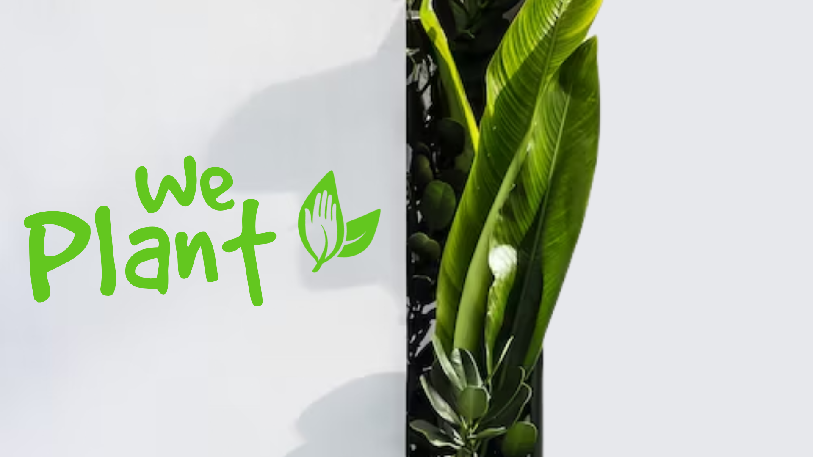

O WePlant é um aplicativo voltado para auxiliar moradores de comunidades na prática da agricultura vertical. A agricultura vertical é uma técnica que permite o cultivo de plantas em espaços reduzidos, aproveitando a verticalidade dos ambientes urbanos. O objetivo do WePlant é fornecer suporte e orientação aos agricultores urbanos, ajudando-os a otimizar o uso de recursos, gerenciar suas plantações e maximizar a produção de alimentos.

 

# Tecnologias Utilizadas

          

    
    
    
    
    
    

 

 

# Configuração e Execução 

Para executar o aplicativo em um ambiente de desenvolvimento, siga as instruções abaixo conforme cada tecnologia:

-
-
-
-

 

# Equipe

     A equipe responsável por esse projeto é composta por:

- RM: 93915 - Jaelson dos Santos  
- RM: 94311 - Marcos Bilobram  
- RM: 96320 - Nathália Maia  
- RM: 94972 - Rafaela da Silva  

        Cada membro da equipe desempenha um papel fundamental no desenvolvimento e no sucesso do projeto, contribuindo com suas habilidades e conhecimentos na área de tecnologia.

 

# Considerações Finais

        O desenvolvimento do WePlant é um projeto realizado como parte da prova semestral da faculdade FIAP, com o tema "Combate à fome através da agricultura sustentável".

        A equipe se empenhou para criar uma solução eficiente e inovadora, que visa promover a segurança alimentar, incentivar a agricultura sustentável e combater a fome nas comunidades.

O projeto WePlant está disponível na íntegra, incluindo todos os códigos-fonte e entregas, na organização do GitHub: 
[https://github.com/WePlant-GS].

 

# Licença
Este projeto está licenciado sob a MIT License.
